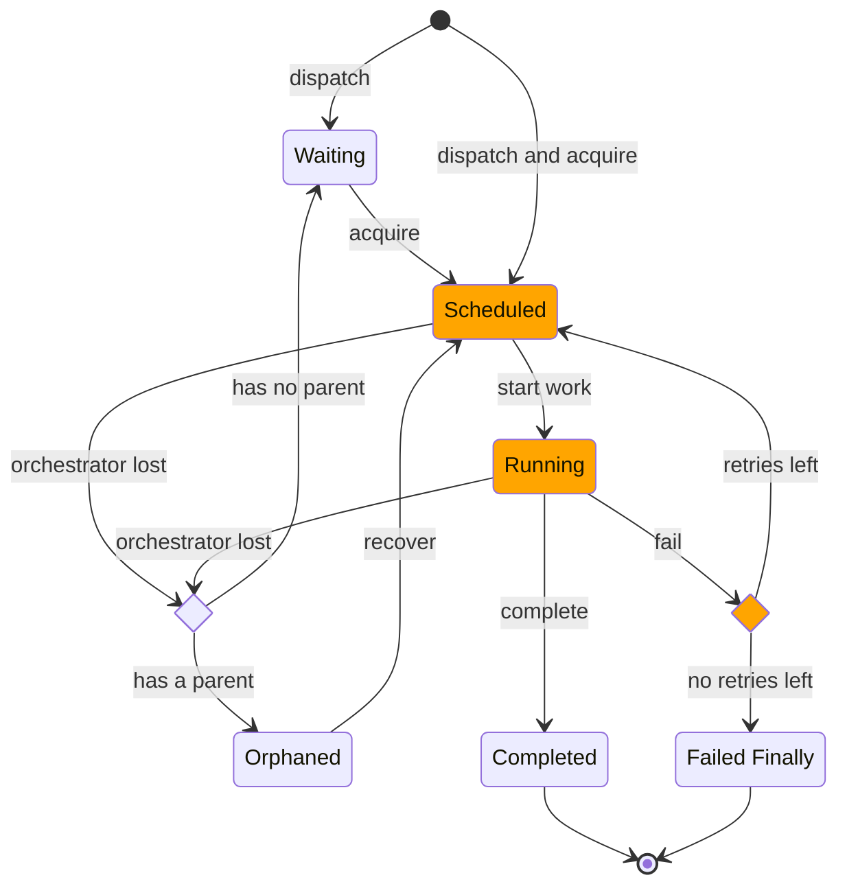

# flive
## Flow Lifecycle

Note: Each arrow in the diagram represents a database transaction. The diamond-shaped choice nodes (ORCHESTRATOR_LOST and FAILED) occur within their respective transactions, ensuring atomicity of state transitions.

Note: The orange-colored states (Scheduled, Running, Failed) indicate that the flow is associated with an orchestrator during these stages. This association ensures proper management and tracking of the flow's lifecycle by the assigned orchestrator.

