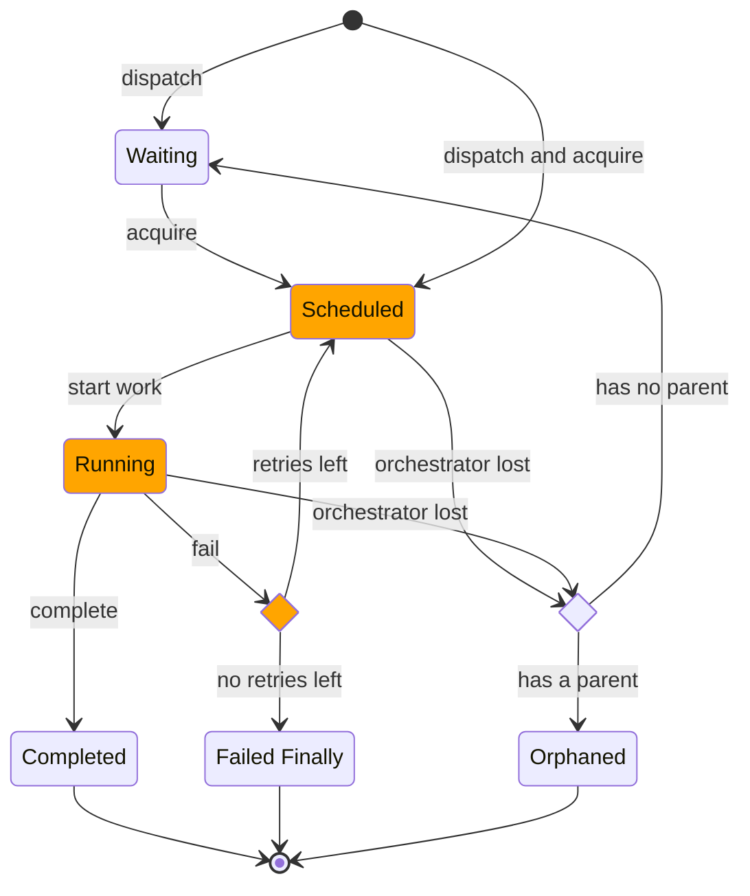

# flive
## Flow Lifecycle

```mermaid
stateDiagram-v2
    classDef associated fill:#FFA500
    WAITING: Waiting
    SCHEDULED: Scheduled
    RUNNING: Running
    COMPLETED: Completed
    FAILED_FINALLY: Failed Finally
    ORPHANED: Orphaned
    state FAILED <<choice>>
    state ORCHESTRATOR_LOST <<choice>>

    [*] --> WAITING: dispatch
    WAITING --> SCHEDULED: acquire
    [*] --> SCHEDULED: dispatch and acquire
    SCHEDULED --> ORCHESTRATOR_LOST: orchestrator lost
    SCHEDULED --> RUNNING: start work
    RUNNING --> ORCHESTRATOR_LOST: orchestrator lost
    ORCHESTRATOR_LOST --> WAITING: has no parent
    RUNNING --> COMPLETED: complete
    RUNNING --> FAILED: fail
    FAILED --> SCHEDULED: retries left
    FAILED --> FAILED_FINALLY: no retries left
    ORCHESTRATOR_LOST --> ORPHANED: has a parent
    COMPLETED --> [*]
    FAILED_FINALLY --> [*]
    ORPHANED --> [*]

    class SCHEDULED,RUNNING,FAILED associated
```
